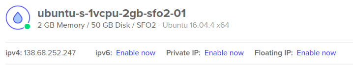
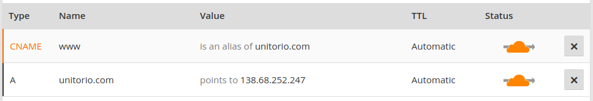
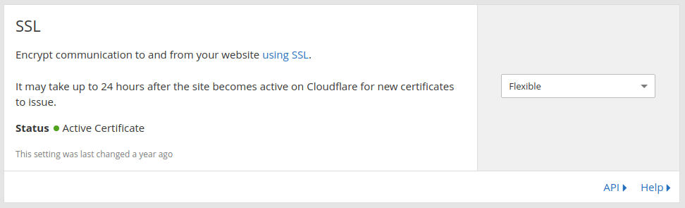
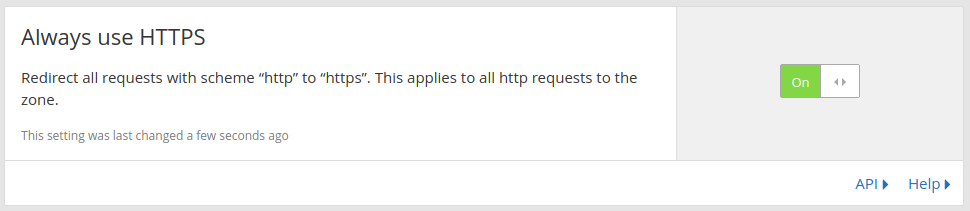

# How to deploy a Cezerin on Ubuntu 16.04

* [Create droplet](#1-create-droplet)
* [Install Docker](#2-install-docker)
* [Run MongoDB](#3-run-mongodb)
* [Run Cezerin](#4-run-cezerin)
* [Preparing Database](#5-preparing-database)
* [Setup domain with](#6-setup-domain-with-cloudflare)
* [Turn off Developer Mode](#7-turn-off-developer-mode)

## 1. Create droplet
I'll use [DigitalOcean](https://www.digitalocean.com/) to deploy Cezerin.

1. Click **Create droplet**
 - Choose an image: `Ubuntu 16.04.4 x64`
 - Choose a size: `2 GB (RAM), 1 vCPU, 50 GB (SSD)`
 - Choose a datacenter region: `San Francisco`
2. Then SSH to droplet.

## 2. Install Docker
[Docker guide.](https://docs.docker.com/install/linux/docker-ce/ubuntu/)

```shell
sudo apt-get update
```
```shell
sudo apt-get install \
    apt-transport-https \
    ca-certificates \
    curl \
    software-properties-common
```
```shell
curl -fsSL https://download.docker.com/linux/ubuntu/gpg | sudo apt-key add -
```
```shell
sudo add-apt-repository \
   "deb [arch=amd64] https://download.docker.com/linux/ubuntu \
   $(lsb_release -cs) \
   stable"
```
```shell
sudo apt-get update
```
```shell
sudo apt-get install docker-ce
```

## 3. Run MongoDB
```shell
docker run --name store-db -v /var/www/store-db:/data/db -d mongo:latest
```

## 4. Run Cezerin
```shell
docker run -d \
--name store \
--link store-db:db \
-p 80:80 \
-e DB_HOST=db \
-e DB_PORT=27017 \
-e DB_NAME=shop \
-v /var/www/store/content:/var/www/cezerin/public/content \
cezerin/cezerin:latest
```
Check logs
```shell
docker logs store
```

## 5. Preparing Database
Run `npm run setup` on Cezerin container to add default data and create indexes.

```shell
sudo docker exec store bash -c "npm run setup"
```

## 6. Setup domain with CloudFlare
[Cloudflare.](https://www.cloudflare.com)

 - Get droplet IP on DigitalOcean


 - Add `A` and `CNAME` to DNS on CloudFlare

 - Set SSL to `Flexible` on CloudFlare


 - Turn on `Always use HTTPS` on CloudFlare


## 7. Turn off Developer Mode
By default, Cezerin is in developer mode. This means you can access API and Dashboard without access tokens.  
To turn off developer mode, you need to do:

 - Add access token in Dashboard or MongoDB
 - Set SMTP server from Dashboard or in `config/server.js`
 - Remove `developerMode` from `config/server.js`
 - Remove `developerMode` from `config/admin.js`
 - `npm run build` inside Cezerin container
 - `pm2 reload api` inside Cezerin container
